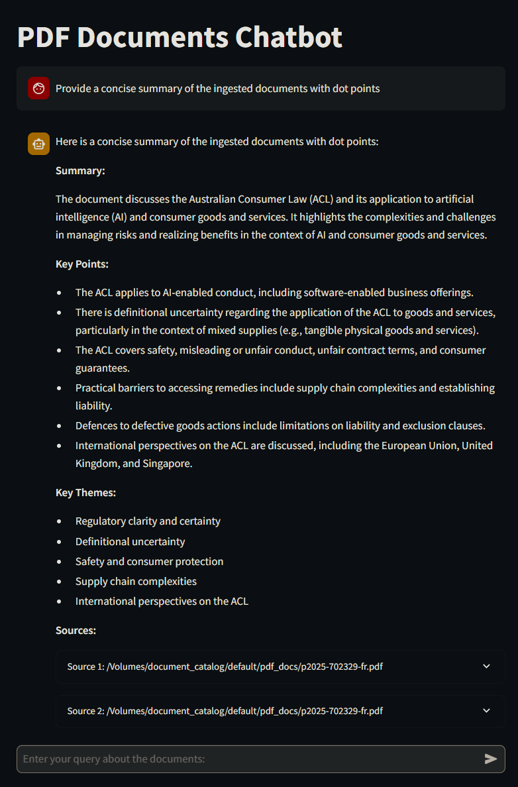
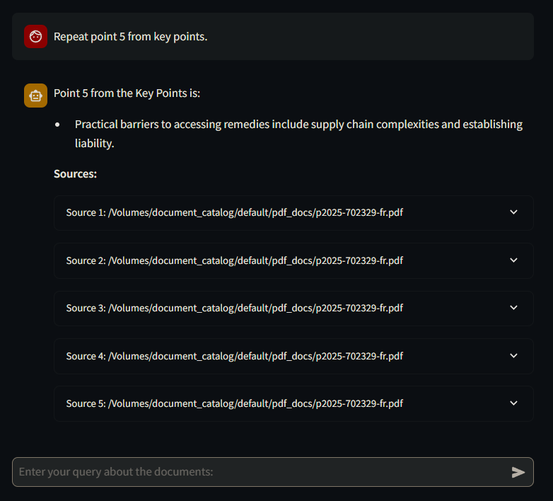

# Databricks Chatbot

A proof of concept conversational AI chatbot built with Databricks, Streamlit and LangChain, powered by Databricks for vector search, embeddings, and LLM inference. This app lets you ingest PDF documents, build a vector store, and query them interactively with chat history awareness. Perfect for document Q&A, research, or knowledge extraction. 🚀

## Overview

This repo provides a production-ready setup for a RAG (Retrieval-Augmented Generation) application focused on PDF documents. Key components:

- **PDF Ingestion & Chunking:** Load PDFs from a Databricks Unity Catalog volume, chunk them into manageable pieces, and store in a Delta Table. 📄
- **Embedding & Vector Search:** Generate embeddings using Databricks endpoints (e.g., `databricks-bge-large-en`) and index them in a Vector Search endpoint for efficient similarity search. 🔍
- **Conversational Retrieval:** A Streamlit app that uses LangChain chains to condense queries with chat history, retrieve relevant chunks, and generate responses via a Databricks LLM (e.g., `databricks-meta-llama-3-1-8b-instruct`). 💬
- **History & Sources:** Maintains session-based chat history and displays sourced document chunks with metadata for transparency. 📜

## Features

✅ History-Aware Queries  
✅ Source Attribution  
✅ Error Handling  
✅ Databricks Integration  
✅ Streamlit UI  

## Screenshots

**Initial response:**

**Follow up response with memory:**

## Prerequisites

A Databricks workspace with access to:

- Unity Catalog (for catalogs, schemas, volumes, and Delta Tables).
- Mosaic AI endpoints for embeddings and LLMs.
- Vector Search enabled.
- Python 3.10+.
- Service principal for OAuth authentication (client ID/secret).
- PDFs uploaded to a Databricks volume (e.g., `/Volumes/document_catalog/default/pdf_docs`).

## Setup

- `setup_unity_catalog.py` - Create UC catalog, volume and schema
- Upload your PDFs to `/Volumes/document_catalog/default/pdf_docs` via Databricks UI or `dbutils.fs.cp`.
- `ingest_and_chunk_data.py` - Ingest and chunk PDF data from input volume path
- `embed_and_vector_store.py` - Compute embeddings and create Vector Search index. 
  - *Note: Vector store has spin-up time in Databricks.*
- `rag_query_results.py` - Test retrieval from notebook.
- Create Databricks App from UI and permission to LLM and embeddings endpoints.
- Deploy `/app` from codebase e.g. `databricks apps deploy app-demo --source-code-path /Workspace/Shared/chatbot/app/`
- `setup_app_permission.py` - Setup app permissions on catalog / schema / table queries
- Startup app and interact with chatbot.

## Usage

- Open the app in your browser.  
- Ask questions about your documents.  
- Chat history persists per session.  
- Expand **Sources** to view retrieved chunks with metadata.

## Manual Interventions Needed ⚠️

- PDF upload (manual).  
- Index sync after new docs.  
- Endpoint provisioning (manual in UI).  
- Scaling and retriever tuning as needed.
